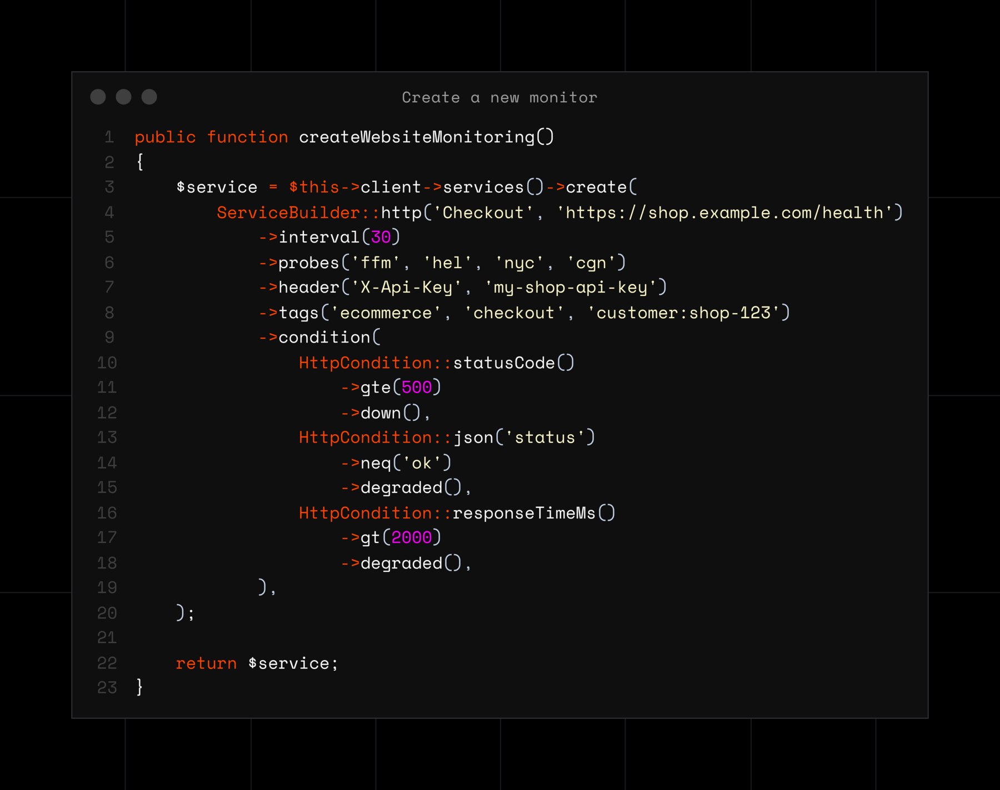

# LIVCK Cloud PHP SDK



The PHP client for the [LIVCK Cloud](https://livck.cloud) API: uptime monitoring, status
pages on [statuspage.de](https://statuspage.de) or your own domain, and the incident and
maintenance history behind them. It talks to LIVCK Cloud (`api.livck.cloud`) only; LIVCK
Self-Hosted is a separate product with its own API.

## Requirements

- PHP 8.3 or later
- A PSR-18 HTTP client with PSR-17 factories. Guzzle 7 is used automatically when it is
  installed; any other client is found through php-http/discovery or passed in.
- An API token of your organization (`lvk_…`, under *Settings → Organization → API tokens*).
  API access starts with the Team plan.

## Installation

```bash
composer require livck/cloud-php
```

No HTTP client in the project yet: `composer require livck/cloud-php guzzlehttp/guzzle`.

## Quick start

```php
use LIVCK\Cloud\Builders\ServiceBuilder;
use LIVCK\Cloud\CloudClient;
use LIVCK\Cloud\Query\ServiceQuery;

$client = new CloudClient($token); // lvk_…, from your secret store

// One tag per end customer; ensure() finds or creates it.
$tag = $client->tags()->ensure('customer', '4711')->tag;

$client->services()->create(
    ServiceBuilder::http('Shop', 'https://shop.example.com')->interval(60)->tags($tag),
);

foreach ($client->services()->each(ServiceQuery::make()->withTag($tag)) as $service) {
    echo $service->name, ': ', $service->effectiveStatus->value, PHP_EOL;
}
```

The client keeps no global state and never changes after construction, so one instance can
serve a long-running worker (Octane, RoadRunner, queues). Type against `CloudClientInterface`.

## Built for resellers

The API works on your whole organization; what separates one end customer from the next is
a tag. Give every customer exactly one, `customer:<number>`, and the rest follows from it:
`tags()->ensure()` finds or creates it on every provisioning run, services carry it,
`ServiceQuery::make()->withTag('customer:4711')` lists exactly that customer's services, a
synced group fills the customer's status page from it, and incidents and maintenance are
filtered through the customer's service ids. The plan caps the number of tags; reaching the
cap is a `ValidationException` on `tags`, or on the entry (`tags.2`) of a service's tag list
that would create one more.

The examples put this together. They read `LIVCK_CLOUD_TOKEN` (and `LIVCK_CLOUD_BASE_URI`
if set), and the ones that write can safely run again:

| Script | Shows |
|---|---|
| [01-onboard-customer.php](examples/01-onboard-customer.php) | Tag, status page with a synced group, HTTP and certificate checks, optional custom domain with the DNS records for the customer |
| [02-customer-status.php](examples/02-customer-status.php) | Status and 30-day uptime per service, open incidents, maintenance, the page's address |
| [03-sync-customers.php](examples/03-sync-customers.php) | Reconciling a billing export with LIVCK from cron, with `--dry-run` |
| [04-offboard-customer.php](examples/04-offboard-customer.php) | Removing a customer's services, status page and tag, in that order |
| [05-error-handling.php](examples/05-error-handling.php) | Each exception type and what to read from it; `request()` |
| [06-fake-client.php](examples/06-fake-client.php) | Testing your integration without a network |

```bash
LIVCK_CLOUD_TOKEN=lvk_… php examples/01-onboard-customer.php 4711 https://www.example.com
```

## Services and the ServiceBuilder

There is one factory per check type (`http()`, `tcp()`, `dns()`, `icmp()`, `ssl()`,
`manual()`). Each builder offers only the options of its type, conditions are typed per
type, and every setter returns a new builder.

```php
use LIVCK\Cloud\Builders\Conditions\HttpCondition;

$catalog = $client->checkTypes(); // what the server accepts today; fetch once, reuse

$service = $client->services()->create(
    ServiceBuilder::http('Checkout', 'https://shop.example.com/health')
        ->interval(30)
        ->probes('ffm', 'hel')
        ->header('X-Api-Key', $apiKey)
        ->tags($tag, 'checkout', 'env=prod')
        ->condition(
            HttpCondition::statusCode()->gte(500)->down(),
            HttpCondition::json('status')->neq('ok')->degraded(),
            HttpCondition::responseTimeMs()->gt(2000)->degraded(),
        ),
    $catalog, // optional: validate against it before anything is sent
);
```

`tags()` takes Tag objects, tag ids and tag names (`critical`, `customer:4711`, `env=prod`) in
any mix, and a name that does not exist yet is created with the service. The one exception is an
entry that looks like a tag id (21 letters, digits, `_` or `-`, with at least one uppercase
letter): it must be an existing tag's id or name, otherwise the server answers with a
`ValidationException` on that entry (`tags.2`). Tag keys are always lowercase, so names are never
affected.

With a catalog, config keys, options, condition fields, operators and the type's interval
range are checked before sending, and every problem is listed in one
`CatalogValidationException`. The plan's limits (minimum interval, locations, conditions)
stay the server's and come back as a `ValidationException` on the field. For options newer
than this SDK, `config()`, `setting()`, `attribute()` and `Condition::custom()` send any key.

## Updating a service

`UpdateService` sends only what you set. `settings.config` is merged per key, and a key you
send replaces that whole block (`headers`, `auth`, `conditions`). Secrets are never read
back; a service shows `__LIVCK_KEEP_UNCHANGED__` (`KeepSecret::keep()`) in their place, and
sending that back keeps them. `basedOn()` starts from the stored settings, secrets kept:

```php
use LIVCK\Cloud\Payloads\UpdateService;

$service = $client->services()->get($id);

$client->services()->update($id, UpdateService::basedOn($service)
    ->withHeader('X-Api-Key', $newKey) // the other headers stay as stored
    ->withIntervalSeconds(60));

// Tags are replaced as a whole: send the full set, by id or by name.
$tags = [...$service->tagIds(), 'customer:4712'];
$client->services()->update($id, UpdateService::make()->withTags(...$tags));
```

## Status pages

```php
use LIVCK\Cloud\Builders\ComponentBuilder;
use LIVCK\Cloud\Payloads\CreateStatuspage;

// Look up first, create when missing: a later run finds what an earlier one made.
$page = $client->statuspages()->findBySlug('acme-4711')
    ?? $client->statuspages()->create(CreateStatuspage::make('Status')->withSlug('acme-4711'));

// Holds every service tagged customer:4711, now and later.
$client->statuspages()->components($page->id)->create(ComponentBuilder::syncedGroup('Services', $tag));

// The customer's own hostname: attach it, then hand them the CNAME and TXT record.
$domain = $client->statuspages()->customDomains($page->id)->attach('status.customer.example');

foreach ($domain->dnsRecords() as $record) {
    echo $record->type, ' ', $record->name, ' -> ', $record->value, PHP_EOL;
}
```

A new page goes online at once when the plan has a free published slot, otherwise it is
created unpublished. The caps on pages and published pages are reported as a
`ValidationException` (on `name` and `is_published`). `findBySlug()` returns the page with
exactly that slug or null (`StatuspageQuery::withSlug()` on the list). A domain activates
itself once LIVCK sees the records (`verify()` asks right away), and `$page->url` then
switches to it.

## History: checks, incidents, maintenance

```php
use LIVCK\Cloud\Enums\CheckResultStatus;
use LIVCK\Cloud\Query\CheckQuery;
use LIVCK\Cloud\Query\IncidentQuery;

// Every failed check of the last day, newest first; one row per check and location.
$failed = CheckQuery::make()->withStatuses(CheckResultStatus::Down)->withFrom(new DateTimeImmutable('-1 day'));

foreach ($client->services()->eachCheck($service->id, $failed) as $check) {
    echo $check->checkedAt->format('c'), ' ', $check->probe, ' ', $check->errorMessage, PHP_EOL;
}

// Open incidents across a customer's services, at most 100 ids per request.
foreach (array_chunk($services, IncidentQuery::MAX_SERVICE_IDS) as $chunk) {
    foreach ($client->incidents()->each(IncidentQuery::make()->withServiceIds($chunk)->withResolved(false)) as $incident) {
        echo $incident->title, PHP_EOL;
    }
}
```

An empty `withServiceIds([])` is sent and matches nothing, while `null` lifts the filter, so
a customer without services never sees everybody's incidents. `maintenances()` takes the
same filter; `uptime()`, `metrics()` and `responseTimes()` hold a service's figures.

## Pagination

`list()` is one request and returns a `Page`: its items plus `total`, `lastPage` and
`nextPage()`. `each()` walks every page, fetching the next one when the loop gets there:

```php
$page = $client->services()->list(ServiceQuery::make()->withPerPage(100));
echo $page->total, ' services on ', $page->lastPage, ' pages', PHP_EOL;

foreach ($client->services()->each() as $service) {
    // all of them, one page in memory at a time
}
```

Collect into an array before deleting what you iterate, or the pages shift under the loop.
The check history is keyset-paginated: a `CursorPage` with `nextCursor` and `next()`.

## Errors

Every exception implements `LIVCK\Cloud\Exceptions\LivckCloudException`. `getMessage()`
combines the server's message with status, method and URI; the token never appears in
messages, dumps or log lines.

| Exception | When |
|---|---|
| `ValidationException` | 422: `errors()`, `firstError('field')`. Some plan limits land here, on their field. |
| `PlanLimitException` | A quota of the plan is used up: `limitKey()`, `limit()`, `usage()`. |
| `FeatureNotAvailableException` | The plan lacks the feature (`featureKey()`, e.g. `api_access`). |
| `PermissionDeniedException` | 403: the token lacks the route's ability. |
| `AuthenticationException` | 401: the token is unknown, revoked or expired. |
| `NotFoundException` | 404: unknown, in another organization, or hidden from the token. |
| `ConflictException` | 409: the resource's state does not allow the action. |
| `RateLimitException` | 429 once the retries are spent: `retryAfter()`. |
| `ServerException` | 5xx; `ServiceUnavailableException` (503) adds `retryAfter()`. |
| `TransportException` | No response at all (DNS, connection, TLS, timeout) after the retries. |
| `UnexpectedResponseException` | The response is not in the documented shape. |
| `CatalogValidationException`, `InvalidArgumentException` | Found on the client; nothing was sent. |

A limit is not a permission problem: `PlanLimitException` and `FeatureNotAvailableException`
go away with a larger plan or by freeing room, `PermissionDeniedException` with a token that
has the right abilities.

```php
use LIVCK\Cloud\Exceptions\ValidationException;

try {
    $client->services()->create($builder);
} catch (ValidationException $e) {
    $message = $e->firstError('settings.interval_seconds') ?? $e->errorMessage();
}
```

## Retries and idempotency

Every POST carries an `Idempotency-Key`, a UUID reused for each retry of that call; the API
keeps the first answer for 24 hours per token and replays it, so a retried create never
creates twice. Retried are connection errors (a POST only with a key), 429 (waiting
`Retry-After` up to `maxRetryAfter`), a 409 while the same key is still being processed, and
502/503/504 for reads, PUT and DELETE. A 5xx after a POST or PATCH is not: check the state
before sending such a write again.

Every creating method takes your own key as its last parameter. A stable key, such as an
order number, makes the create safe to repeat after a crash, for 24 hours, per token; the
same key with a different payload is a `ValidationException`:

```php
$page = $client->statuspages()->create(CreateStatuspage::make('Status'), idempotencyKey: 'order-4711-statuspage');
$service = $client->services()->create($builder, idempotencyKey: 'order-4711-shop');
```

`idempotency: false` in the options sends no key at all; `withoutIdempotencyKey()` on a
`Request` does the same for one request sent through `send()`.

## Forward compatibility

The API grows between SDK releases, and nothing new breaks your code. Every DTO keeps the
payload as received in `$raw`. An enum value this version does not know becomes the
`Unrecognized` case, with the original string in `$raw` (sending `Unrecognized` is refused).
Builders take raw keys, and so does `UpdateService` (`withConfig()`, `withSetting()`,
`withAttribute()`). `request()` reaches any endpoint through the same transport and returns
the raw `Response`:

```php
use LIVCK\Cloud\Builders\Conditions\Condition;

$type = $service->checkType->isUnrecognized() ? $service->raw['check_type'] : $service->checkType->value;

ServiceBuilder::http('Shop', 'https://shop.example.com')
    ->config('new_option', true)      // a key of settings.config
    ->setting('new_setting', 3)       // a key of settings
    ->attribute('new_field', 'value') // a top-level key of the request body
    ->condition(Condition::custom('metadata.new_field', 'eq', 'expected'));

$onCall = $client->request('GET', 'oncall/on-call')->json(); // not wrapped yet
```

## Configuration

Everything but the token lives in the immutable `ClientOptions`, e.g.
`new CloudClient($token, new ClientOptions(locale: 'de', logger: $logger))`;
`$client->withOptions()`, `withLocale()` and `withHttpClient()` return a new client.

| Option | Default | Notes |
|---|---|---|
| `baseUri` | `https://api.livck.cloud/v1` | https; plain http only for loopback hosts |
| `locale` | none | `Accept-Language`: the language translatable fields come in |
| `timeout`, `connectTimeout` | 30 s, 10 s | Applied when the SDK builds Guzzle itself |
| `maxRetries` | 2 | Attempts after the first; 0 turns retries off |
| `backoffBase`, `backoffCap` | 0.5 s, 8 s | Exponential backoff with full jitter |
| `maxRetryAfter` | 60 s | A longer `Retry-After` fails at once instead of waiting |
| `idempotency` | `true` | An `Idempotency-Key` on every POST |
| `userAgentSuffix` | none | Appended to `livck-cloud-php/<version> PHP/<version>` |
| `logger` | `NullLogger` | PSR-3; one debug line per attempt, never headers or bodies |

## Testing your integration

`CloudClient::fake()` wires a client to an in-memory HTTP client: nothing leaves the process,
retries do not sleep, and every request is recorded.

```php
use LIVCK\Cloud\Testing\MockResponse;
use LIVCK\Cloud\Testing\RecordedRequest;

[$client, $http] = CloudClient::fake([
    MockResponse::json(['data' => $tagPayload], 201),
    MockResponse::error('Plan limit reached.', 403, extra: ['upsell' => ['reason' => 'limit', 'key' => 'services']]),
]);

// Run your code against $client, then:
$http->assertSentCount(2);
$http->assertSent(fn(RecordedRequest $r): bool => $r->matches('POST', '/v1/tags/ensure'));
```

`MockResponse` also builds list pages, network errors and replays; `$http->recorded()` and
`$http->delays()` show what was sent and how long retries would have waited.

## Links

- Documentation: [docs.livck.cloud](https://docs.livck.cloud)
- API reference: [api.livck.cloud](https://api.livck.cloud)
- Status pages: [statuspage.de](https://statuspage.de)

## License

MIT. See [LICENSE](LICENSE).
